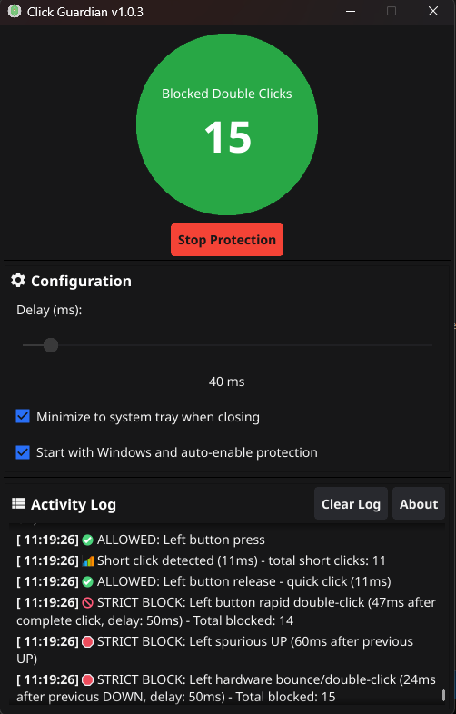

  

<h1 align="center">Click Guardian</h1>

  <strong>An application that prevents accidental double-clicks by introducing a customizable delay between mouse clicks - currently available on Windows.</strong>

  

## Features

- 🎯 **Strict Double-Click Blocking**: Ensures no double-clicks are allowed under any circumstances
- ⚙️ **Customizable Delay**: Set delay from 5ms to 500ms (default: 50ms)
- � **Adaptive Protection**: Automatically increases delay when faulty mouse hardware is detected (never decreases below user setting)
- �📊 **Real-time Logging**: Detailed logs for allowed and blocked clicks, including reasons and timestamps
- 🖥️ **Modern GUI**: Clean and intuitive Fyne-based interface
- 🚀 **Lightweight**: Minimal resource usage
- 🛡️ **Safe**: Only monitors clicks, doesn't interfere with other mouse operations

## How It Works

The application installs a low-level mouse hook that monitors left and right mouse button clicks. When a click is detected:

1. **First Click**: Always allowed and logged
2. **Subsequent Clicks**: Strictly blocked if they occur within the specified delay period for that specific button
3. **Independent Timers**: Left and right mouse buttons have separate timers - switching between buttons doesn't reset the protection
4. **Adaptive Protection**: Automatically detects faulty mouse hardware patterns (like low-pressure clicks) and increases the protection delay accordingly - never reduces below your selected setting

The adaptive system ensures maximum protection against problematic mice while maintaining your chosen baseline delay for normal operation.

## Quick Start

1. **Set Delay**: Enter your desired delay in milliseconds (5-500ms)
2. **Start Protection**: Click "Start Protection" to begin monitoring clicks
3. **Monitor Activity**: Watch the real-time log showing allowed/blocked clicks
4. **Stop Protection**: Click "Stop Protection" when finished

### Auto-Start Features

- **Start with Windows**: Enable "Start with Windows and auto-enable protection" to automatically launch when Windows boots
- **Seamless Protection**: When enabled, the app starts minimized to system tray and automatically begins protection with your configured delay
- **Perfect for Always-On Protection**: One checkbox for complete hands-off protection that starts automatically with Windows

_Tip: Start with the default 50ms delay - it works well for most users._

## Installation

### Download Release

**Official releases with proper versioning, code signing, and Windows integration:**

1. Go to [Releases](../../releases) page
2. Download the latest `click-guardian-v*.zip`
3. Extract and run `click-guardian-gui.exe`

**Alternative downloads:**

- `click-guardian-gui.exe` - Main application (recommended)
- `click-guardian.exe` - Console version (shows debug output)

### Build from Source

For development or custom builds, see [**Release Build Guide**](docs/RELEASE_BUILD.md) for professional builds with:

- Proper versioning and metadata
- Windows resources and icons
- Optional code signing
- Release packaging

**Quick development build:**

For detailed build instructions, see [**Development Guide**](docs/DEVELOPMENT.md)

## Configuration

- **Default Delay**: 50ms (good for most users)
- **Recommended Range**: 30-100ms for most applications
- **Gaming**: 10-30ms for fast-paced games
- **Accessibility**: 100-500ms for users with motor difficulties

## ⚠️ Important Anti-Cheat Warning

**MULTIPLAYER GAMING COMPATIBILITY NOTICE**

This application uses low-level mouse hooks that may be detected by anti-cheat systems as potentially malicious software. **Use with caution when playing multiplayer games**.

### Anti-Cheat Systems That May Flag This Application:

- **BattlEye** (PUBG, Rainbow Six Siege, Fortnite, etc.)
- **EasyAntiCheat** (Apex Legends, Fall Guys, Rocket League, etc.)
- **Vanguard** (Valorant) - _Extremely strict detection_
- **VAC** (Steam games like CS2, Dota 2, etc.)
- **FairFight/PunkBuster** (Battlefield series, etc.)

### Recommendations for Gamers:

1. **Stop Protection Before Gaming**: Always disable Click Guardian before launching multiplayer games
2. **Exit Completely**: Use "Quit Application" from the system tray rather than just minimizing
3. **Test in Single Player**: If unsure, test with single-player games first
4. **Create Gaming Profile**: Consider using Windows Task Scheduler to automatically stop the service during gaming hours

### Why This Happens:

Anti-cheat systems flag applications that:

- Install system-wide mouse hooks
- Block or modify mouse input events
- Monitor global system activity

While Click Guardian is legitimate accessibility software, its technical methods are similar to those used by cheating software.

**We are not responsible for any account bans or penalties resulting from anti-cheat detection. Use at your own risk with online games.**

## Documentation

- 📖 [**Development Guide**](docs/DEVELOPMENT.md) - Building, project structure, and development setup
- ⚙️ [**VSCode Setup**](docs/VSCODE_SETUP.md) - IDE configuration and troubleshooting
- 🔧 [**Build Instructions**](docs/BUILD.md) - Detailed build documentation

## Cross-Platform Support

- **Windows**: ✅ Fully supported (current)
- **Linux**: 🚧 Planned (X11/Wayland support)
- **macOS**: 🚧 Planned

## Contributing

Feel free to submit issues and pull requests to improve this application. See the [Development Guide](docs/DEVELOPMENT.md) for getting started.

## License

This project is open source and available under the GNU General Public License v3.0 License. Please see [License File](LICENSE.txt) for more information.
